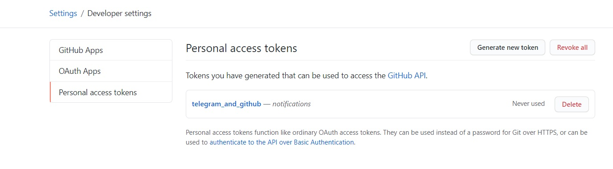
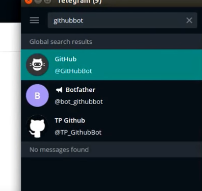

# Project 2 - Sample to show that one can edit, amend, update, delete accordingly and it will be notified by a bot on Telegram in a group.
# DEVELOPMENT + OPERATIONAL = DEVOPS. Continuous integration (CI) and Continuous delivery (CD) embody a culture, set of operating principles, and collection of practices that enable application development teams to deliver code changes more frequently and reliably. The implementation is also known as the CI/CD pipeline.

//Test test test

// Telegram page: https://t.me/CICDproject2

//Any modifications done to this will be auto triggered and be notified via telegram in above telegram page. This is a sample message. Test test. Update again!

## HOW TO GET NOTIFICATIONS FROM GITHUB RESPOSITORY

## Steps

### Ensure that under developer setting, you have authorised and give a token for Telegram to access notification and broadcast it in the group.

### Open Telegram, search for GitHub Bot and /start and follow the instructions, ensure you authorise GitHub and vice versa to pair the two and ensure the respective repository is selected.

### Now when paired, you will get a notification on Telegram whenever anyone commits to any activity onto your work saved in your respository.

